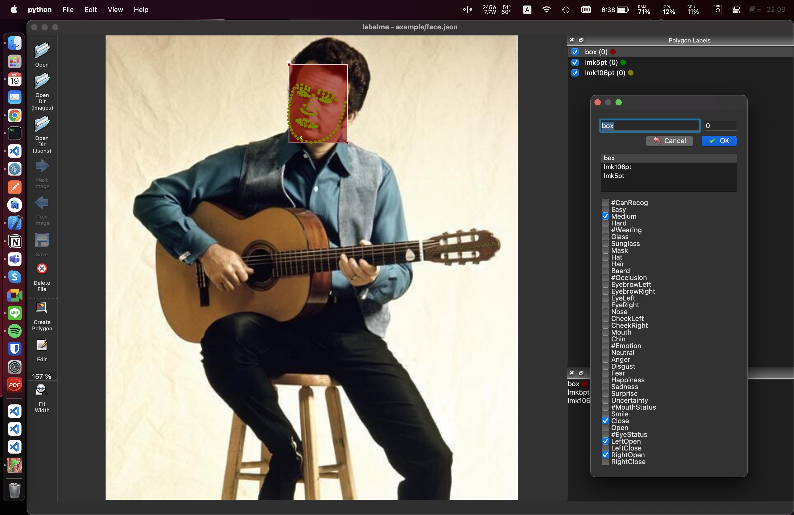
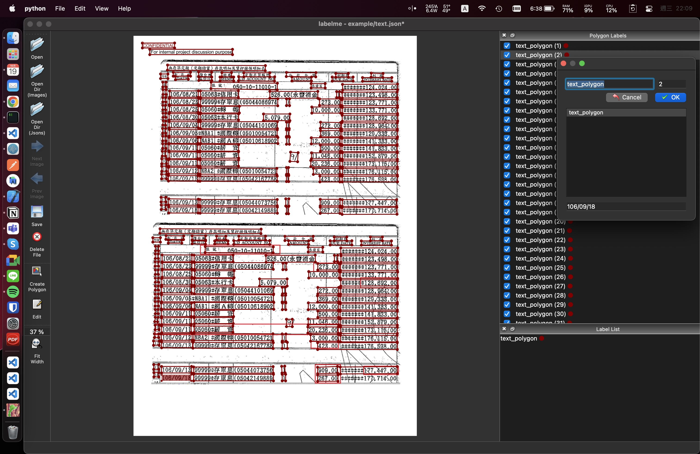

# Authme Revise-Labelme

This labelme is used to label box, keypoints and multi-class label on an instance.

## Face label

```bash
ipython --pdb -- labelme/__main__.py example/face.json --labelflags label_flags/face_flags.yaml
```



## Text label

```bash
ipython --pdb -- labelme/__main__.py example/text.json --labelflags label_flags/text_flags.yaml
```



**Or you can define any flags by defined yaml**
